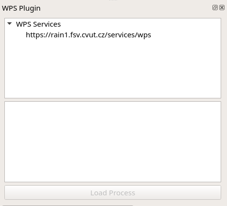
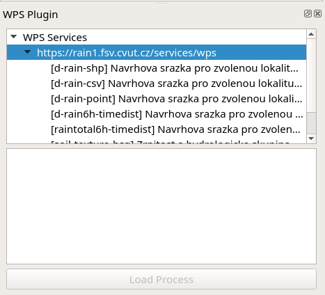
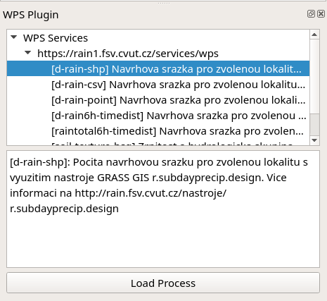
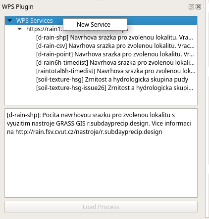
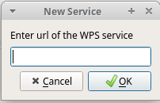
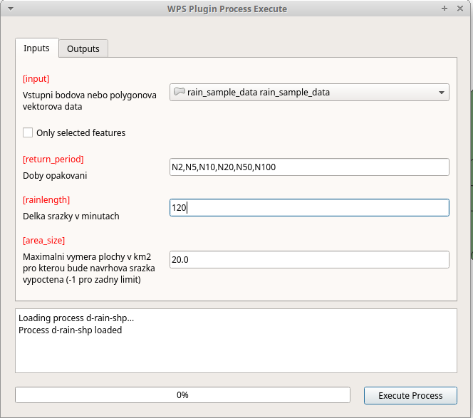
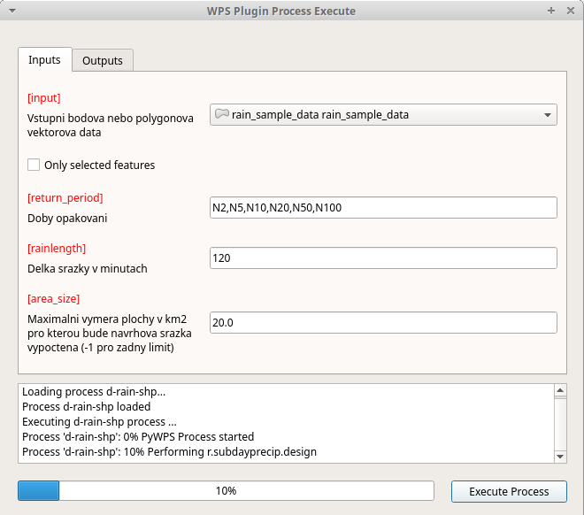
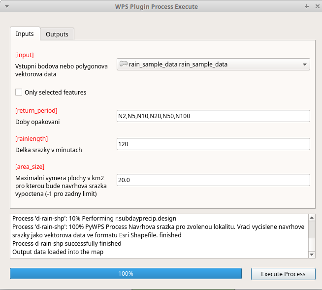
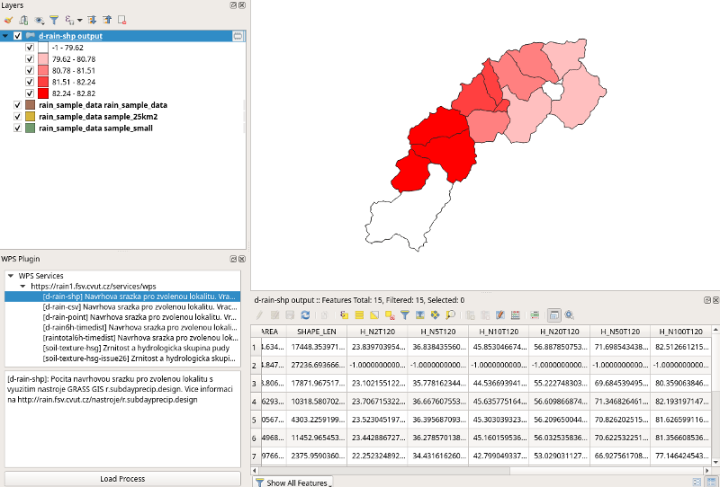
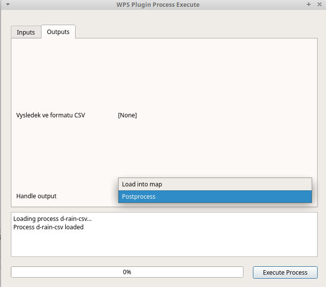

QGIS Web Processing Service Client
##################################

This plugin provides a basic implementation of OGC `Web Processing
Service <https://www.ogc.org/standards/wps>`__ (WPS) client for QGIS Desktop
environment. It is based on `OWSLib
<https://geopython.github.io/OWSLib/>`__ and allows to run all three
requests on WPS:

* GetCapabilities
* DescribeProcess
* Execute

Introduction
============

Plugin is accessible from Plugins Toolbar:

Plugin is implemented as dockable widget for listing WPS services and
processes and a standalone dialog for executing a WPS process.

Usage
=====

The plugin allows to add new services, list processes for the selected
service and open dialog to run the process.

To list processes just click by left mouse button on service from the list.

To show process description just click on the process by left button of the mouse.

To run process you can use three possible ways:

* Click on button ``Load Process``
* Double click by left mouse button on process in the list
* Right mouse button click on process in the list and ``Execute`` button
  from contextual menu

.. image:: images/load.png

To add service use right mouse button click on ``WPS Services``:

Then you enter URL of the service in dialog:

Execute WPS process
-------------------

Process execution is done on the dialog where you can specify Inputs
and Outputs. The inputs are usually some data layers and
parameters. The outputs is usually some data layer or table.

The output should be automatically loaded into map or if the result
needs some postprocessing it may be postprocessed by a script stored
in the data structure of the plugin. There are two sample
postprocessing scripts already distributed with the plugin.

If the results can not be loaded into map its content is shown in the
log text area of the dialog.

WPS process presented on image above calculates amount of rain to
produce 2 to 100 year flood. The inputs are water basins in a form of
polygon layer, list of floods periods and length of the rain in
minutes.

The output is layer where for each polygon the amount of rain is
calculated.

Following images show how the process is executed. The process
execution is done by ``Execute Process`` button. Then the user can see
progress in progress bar and log text area.

When the process is finished a new layer is loaded into map. You can
see classified result on the following image with table where are
results of the calculation for all selected periods.

Handling output
---------------

The output can be loaded into map or postprocessed. In a case when
there is postprocessing script as a part of plugin the dialog allows
to select ``Postprocessing`` option on ``Output`` tab of the dialog.

Postprocessing scripts are stored in ``postprocessing`` directory of
the plugin.  For each service has to be created directory that is
named according to URL of the service.

The naming convention is as follow:

URL: https://rain1.fsv.cvut.cz/services/wps

Directory name: ``rain1_fsv_cvut_cz_services_wps``

So dots and slashes are changed into underscore character and
``https://`` is removed.

The script is then named according to the identifier of the process.

Following script loads result in a form of CSV and joins it with input
layer.

.. code-block:: python

  import os

  from qgis.utils import iface
  from qgis.core import QgsVectorLayer, QgsProject
  from qgis.gui import QgsMapLayerComboBox, QgsFieldComboBox

  import processing

  class wps_postprocessing:
      def postprocess(self, inputs, response):
          process_identifier = os.path.splitext(os.path.basename(__file__))[0]
          try:
              csv_uri = 'file:///' + response.output['output'].filepath + '?delimiter=,'
              csv = QgsVectorLayer(csv_uri, "{} output".format(process_identifier), 'delimitedtext')
              QgsProject.instance().addMapLayer(csv)
              layer = None
              layerField = None
              csvField = None
              for param, widget in inputs.items():
                  if isinstance(widget, QgsMapLayerComboBox):
                      layer = widget.currentLayer()
                  elif isinstance(widget, QgsFieldComboBox):
                      layerField = widget.currentField()
              csvField = csv.fields()[0].name()

              if layer is not None and layerField is not None and csv is not None and csvField is not None:
                  parameters = { 'DISCARD_NONMATCHING' : False, 'FIELD' : layerField, 'FIELDS_TO_COPY' : [], 'FIELD_2' : csvField, 'INPUT' : layer.source(), 'INPUT_2' : csv.source(), 'METHOD' : 1, 'OUTPUT' : 'TEMPORARY_OUTPUT', 'PREFIX' : '' }
                  processing.runAndLoadResults('qgis:joinattributestable', parameters)
          except Exception as e:
              print(e)
              return None

          return 0

Funding
=======

This work is co-financed under Grant Agreement Connecting Europe
Facility (CEF) Telecom `project 2018-EU-IA-0095
<https://ec.europa.eu/inea/en/connecting-europe-facility/cef-telecom/2018-eu-ia-0095>`_
by the European Union.

.. image:: images/CEF_programme_logo_650px.png
          
